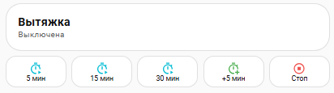
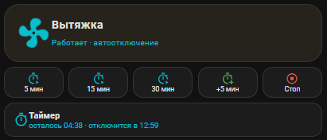

# 🌀 Exhaust Fan PRO — карточка вытяжки для Home Assistant

Панель управления принудительной вытяжкой: hero-блок с крутящимся вентилятором,
запуск на 5/15/30 минут, продление «+5 мин», стоп, и живая строка таймера
с посекундным отсчётом. Всё оформление — один package-файл и одна карточка
Lovelace. Никаких лишних сущностей на экране: нажал — работает.

> Exhaust fan control panel for Home Assistant: animated hero card, quick timers,
> live per-second countdown row, auto-shutdown. One package file + one Lovelace card.

## ✨ Возможности

- 🌀 Hero-блок (button-card): крутящийся вентилятор и неоновое свечение при работе
- ⏱ Запуск на 5 / 15 / 30 минут одной кнопкой, «+5 мин» и «Стоп»
- ⏳ Информационная строка таймера: «осталось ММ:СС · отключится в ЧЧ:ММ», тик каждую секунду, не кликабельна
- 🤖 Автоотключение: любое включение стартует таймер (по умолчанию 15 мин), по истечении реле выключается
- 🔌 Ручное выключение сбрасывает таймер
- 🎨 Поверхности и текст адаптируются к любой теме, акцент фиксированный — ничего не «пропадает» при смене темы
- 🧩 Package-подход: один файл, не ломает основной `configuration.yaml`, отключается переименованием файла

## 📦 Требования

- Home Assistant **2024.8+**
- HACS-карточка: [button-card](https://github.com/custom-cards/button-card)
- Любое on/off-реле (автор использует Tuya switch)

## 🚀 Установка

1. HACS → Frontend → установите **button-card**.
2. Скопируйте `packages/vytyazhka.yaml` в `/config/packages/`.
3. Добавьте один раз в `configuration.yaml`:
   ```yaml
   homeassistant:
     packages: !include_dir_named packages
   ```
4. Чтобы посекундный сенсор не раздувал базу, добавьте в `configuration.yaml`:
   ```yaml
   recorder:
     exclude:
       entities:
         - sensor.vytyazhka_timer_left
   ```
5. Замените в `packages/vytyazhka.yaml` и `lovelace/exhaust_card.yaml`
   `switch.prinuditelnaia_vytiazhka_switch_1` на entity_id вашего реле.
6. «Проверить конфигурацию» → перезапуск HA.
7. Дашборд → ⋮ → Редактор кода → вставьте содержимое `lovelace/exhaust_card.yaml`.

## 🎨 Кастомизация

- Акцент: замените `#00bcd4` на свой цвет (hero, кнопки, строка таймера).
- Скорость вентилятора: `animation: spin 1.2s linear infinite`.
- Время по умолчанию: помощник `input_number.vytyazhka_time` (1–120 мин).

## 📸 Скриншоты





## 🗺 Roadmap

- [ ] Универсальный hero-шаблон для других устройств (бойлер, осушитель…)
- [ ] Wall-версия для настенной панели (крупные шрифты)
- [ ] Автозапуск по датчику влажности/CO₂

## 📄 Лицензия

MIT
