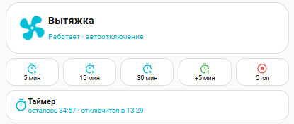

# 🌀 Exhaust Fan PRO — панель вытяжки для Home Assistant

Панель управления принудительной вытяжкой: hero-блок с крутящимся вентилятором,
кнопки быстрого запуска 5/15/30 минут, продление «+5 мин», стоп, и живая строка
таймера с посекундным отсчётом. Всё оформление — один package-файл и одна
карточка Lovelace. Никаких лишних сущностей на экране: нажал — работает.





## ✨ Возможности

- 🌀 Hero-блок (button-card): крутящийся вентилятор и неоновое свечение при работе
- ⏱ Запуск на 5 / 15 / 30 минут одной кнопкой, «+5 мин» и «Стоп»
- ⏳ Информационная строка таймера: «осталось ММ:СС · отключится в ЧЧ:ММ», тик каждую секунду, не кликабельна
- 🤖 Автоотключение: любое включение стартует таймер (по умолчанию 15 мин), по истечении реле выключается
- 🔌 Ручное выключение сбрасывает таймер
- 🎨 Темизация: поверхности и текст адаптируются к любой теме (`var(--…)`), акцент фиксированный
- 🧩 Package-подход: один файл, не ломает основной `configuration.yaml`, отключается переименованием
- 📊 Посекундный сенсор исключён из recorder, чтобы не раздувать базу

## 🧩 Требования

- Home Assistant **2024.8+**
- Компонент из HACS (Frontend):
  - [button-card](https://github.com/custom-cards/button-card)
- Любое on/off-реле (автор использует Tuya switch)

## 🚀 Установка

1. HACS → Frontend → установите **button-card**.
2. Скопируйте `packages/vytyazhka.yaml` в `/config/packages/`.
3. Добавьте один раз в `configuration.yaml`:
   ```yaml
   homeassistant:
     packages: !include_dir_named packages
   ```
4. Чтобы посекундный сенсор не раздувал базу, добавьте в `configuration.yaml`:
   ```yaml
   recorder:
     exclude:
       entities:
         - sensor.vytyazhka_timer_left
   ```
5. Замените в `packages/vytyazhka.yaml` и `lovelace/exhaust_card.yaml`
   `switch.prinuditelnaia_vytiazhka_switch_1` на entity_id вашего реле.
6. «Проверить конфигурацию» → перезапуск HA.
7. Дашборд → ⋮ → Редактор кода → вставьте содержимое `lovelace/exhaust_card.yaml`.

## ⚙️ Настройка

| Что заменить | Где | Пример |
|---|---|---|
| `switch.prinuditelnaia_vytiazhka_switch_1` | package + карточка (3 места) | `switch.moya_vytyazhka` |
| Время по умолчанию | Помощник `input_number.vytyazhka_time` | 15 (минут) |

Остальное (таймер, скрипты, автоматизации, сенсор остатка) создаётся автоматически
из package-файла при первом рестарте.

## 📄 Код карточки

```yaml
type: vertical-stack
cards:
  # ===== HERO =====
  - type: custom:button-card
    entity: switch.prinuditelnaia_vytiazhka_switch_1
    name: Вытяжка
    icon: mdi:fan
    show_state: false
    show_label: true
    label: |
      [[[
        const t = states['timer.vytyazhka'];
        if (entity.state === 'on') {
          return (t && t.state === 'active') ? 'Работает · автоотключение' : 'Работает без таймера';
        }
        return 'Выключена';
      ]]]
    tap_action:
      action: toggle
    hold_action:
      action: more-info
    extra_styles: |
      @keyframes spin { 100% { transform: rotate(360deg); } }
    styles:
      card:
        - border-radius: 24px
        - padding: 16px 18px
        - background: var(--ha-card-background, var(--card-background-color))
        - border: 1px solid var(--ha-card-border-color, var(--divider-color))
      grid:
        - grid-template-areas: '"i n" "i l"'
        - grid-template-columns: auto 1fr
        - grid-template-rows: auto auto
      icon:
        - width: 56px
        - color: var(--secondary-text-color, #9aa7b4)
      name:
        - font-size: 18px
        - font-weight: 600
        - justify-self: start
        - color: var(--primary-text-color)
      label:
        - font-size: 13px
        - color: var(--secondary-text-color)
        - justify-self: start
    state:
      - value: 'on'
        styles:
          card:
            - background: var(--ha-card-background, var(--card-background-color))
            - background: color-mix(in srgb, #00bcd4 16%, var(--ha-card-background, var(--card-background-color)))
            - border: 1px solid var(--ha-card-border-color, var(--divider-color))
            - border: 1px solid color-mix(in srgb, #00bcd4 55%, transparent)
            - box-shadow: 0 0 22px color-mix(in srgb, #00bcd4 22%, transparent)
          icon:
            - color: '#00bcd4'
            - animation: spin 1.2s linear infinite
          label:
            - color: '#00bcd4'

  # ===== 5 кнопок в ряд =====
  - type: horizontal-stack
    cards:
      - type: custom:button-card
        show_icon: true
        show_name: true
        name: 5 мин
        icon: mdi:timer-play-outline
        tap_action:
          action: perform-action
          perform_action: script.vytyazhka_on_for
          data:
            minutes: 5
        styles:
          card:
            - border-radius: 16px
            - padding: 6px 4px
            - background: var(--ha-card-background, var(--card-background-color))
            - border: 1px solid var(--ha-card-border-color, var(--divider-color))
          icon:
            - width: 20px
            - color: '#00bcd4'
          name:
            - font-size: 11px
            - color: var(--primary-text-color)
      - type: custom:button-card
        show_icon: true
        show_name: true
        name: 15 мин
        icon: mdi:timer-play-outline
        tap_action:
          action: perform-action
          perform_action: script.vytyazhka_on_for
          data:
            minutes: 15
        styles:
          card:
            - border-radius: 16px
            - padding: 6px 4px
            - background: var(--ha-card-background, var(--card-background-color))
            - border: 1px solid var(--ha-card-border-color, var(--divider-color))
          icon:
            - width: 20px
            - color: '#00bcd4'
          name:
            - font-size: 11px
            - color: var(--primary-text-color)
      - type: custom:button-card
        show_icon: true
        show_name: true
        name: 30 мин
        icon: mdi:timer-play-outline
        tap_action:
          action: perform-action
          perform_action: script.vytyazhka_on_for
          data:
            minutes: 30
        styles:
          card:
            - border-radius: 16px
            - padding: 6px 4px
            - background: var(--ha-card-background, var(--card-background-color))
            - border: 1px solid var(--ha-card-border-color, var(--divider-color))
          icon:
            - width: 20px
            - color: '#00bcd4'
          name:
            - font-size: 11px
            - color: var(--primary-text-color)
      - type: custom:button-card
        show_icon: true
        show_name: true
        name: +5 мин
        icon: mdi:timer-plus-outline
        tap_action:
          action: perform-action
          perform_action: script.vytyazhka_add_time
        styles:
          card:
            - border-radius: 16px
            - padding: 6px 4px
            - background: var(--ha-card-background, var(--card-background-color))
            - border: 1px solid var(--ha-card-border-color, var(--divider-color))
          icon:
            - width: 20px
            - color: '#4caf50'
          name:
            - font-size: 11px
            - color: var(--primary-text-color)
      - type: custom:button-card
        show_icon: true
        show_name: true
        name: Стоп
        icon: mdi:stop-circle-outline
        tap_action:
          action: perform-action
          perform_action: switch.turn_off
          target:
            entity_id: switch.prinuditelnaia_vytiazhka_switch_1
        styles:
          card:
            - border-radius: 16px
            - padding: 6px 4px
            - background: var(--ha-card-background, var(--card-background-color))
            - border: 1px solid var(--ha-card-border-color, var(--divider-color))
          icon:
            - width: 20px
            - color: '#ef5350'
          name:
            - font-size: 11px
            - color: var(--primary-text-color)

  # ===== Строка таймера: информация, не кликабельна =====
  - type: conditional
    conditions:
      - condition: state
        entity: timer.vytyazhka
        state: active
    card:
      type: custom:button-card
      entity: timer.vytyazhka
      show_icon: true
      show_name: true
      show_state: false
      show_label: true
      name: Таймер
      icon: mdi:timer-outline
      label: |
        [[[
          const left = (states['sensor.vytyazhka_timer_left'] || {}).state || '--:--';
          const f = entity.attributes.finishes_at;
          let end = '';
          if (f) {
            const d = new Date(f);
            end = ' · отключится в ' + d.toLocaleTimeString([], {hour: '2-digit', minute: '2-digit'});
          }
          return 'осталось ' + left + end;
        ]]]
      tap_action:
        action: none
      hold_action:
        action: none
      double_tap_action:
        action: none
      styles:
        card:
          - border-radius: 16px
          - padding: 10px 14px
          - background: var(--ha-card-background, var(--card-background-color))
          - border: 1px solid var(--ha-card-border-color, var(--divider-color))
          - cursor: default
        grid:
          - grid-template-areas: '"i n" "i l"'
          - grid-template-columns: auto 1fr
          - grid-template-rows: auto auto
        icon:
          - width: 24px
          - color: '#00bcd4'
        name:
          - font-size: 14px
          - font-weight: 600
          - justify-self: start
          - color: var(--primary-text-color)
        label:
          - font-size: 12px
          - color: '#00bcd4'
          - justify-self: start
```

## 🎨 Кастомизация

| Что крутить | Где | Эффект |
|---|---|---|
| `#00bcd4` (5 мест) | hero, кнопки, строка таймера | цвет акцента (замените на свой) |
| `animation: spin 1.2s` | hero → styles | скорость вращения вентилятора |
| `input_number.vytyazhka_time` | Настройки → Помощники | время автоотключения по умолчанию |
| `minutes: 5/15/30` | карточка → кнопки | значения быстрого запуска |

## 🌗 Темы

Все поверхности и тексты берутся из переменных темы HA
(`--ha-card-background`, `--card-background-color`, `--primary-text-color`,
`--secondary-text-color`, `--ha-card-border-color`, `--divider-color`),
поэтому карточка автоматически выглядит нативно и в светлой, и в тёмной теме.
Акцент `#00bcd4` — фиксированный, чтобы иконки и свечение не «пропадали»
при смене темы.

## 🗺 Roadmap

- [ ] Универсальный hero-шаблон для других устройств (бойлер, осушитель…)
- [ ] Wall-версия для настенной панели (крупные шрифты)
- [ ] Автозапуск по датчику влажности/CO₂

## 📄 Лицензия

MIT — см. [LICENSE](LICENSE). Используйте, меняйте, делитесь.
